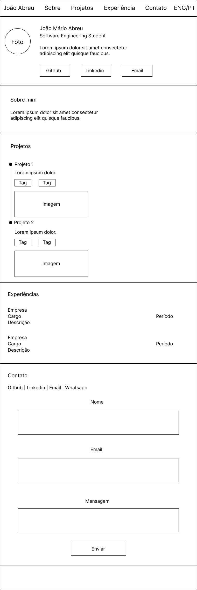
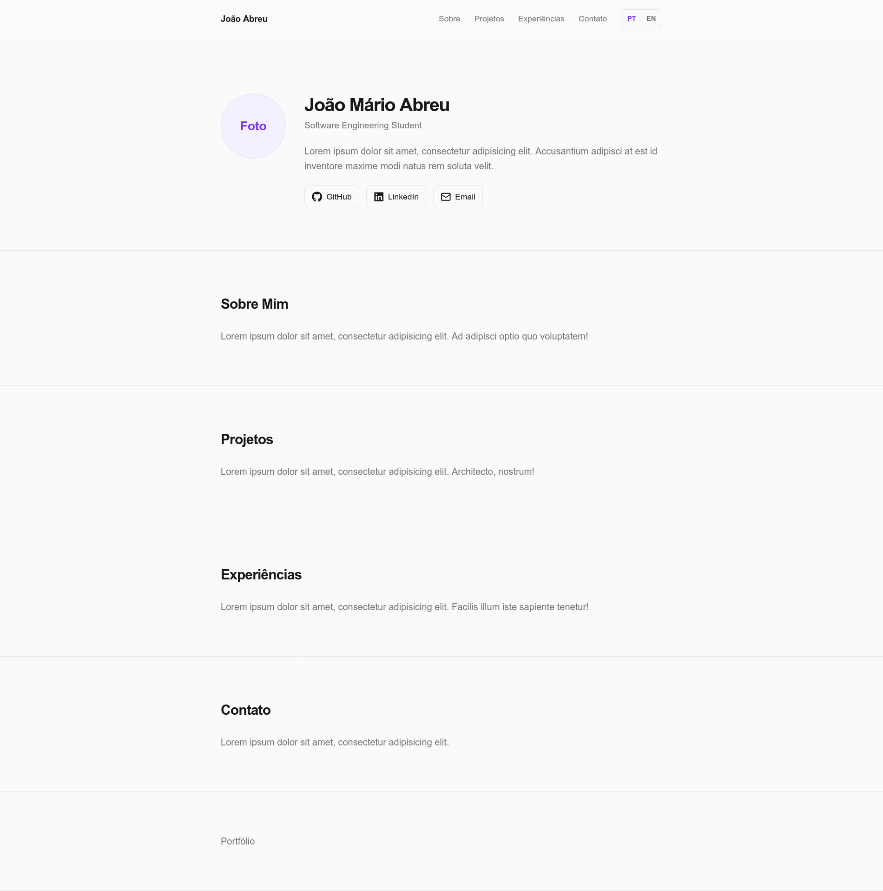

# Portfólio Profissional - Planejamento e Prototipação do Site

Primeira sprint do portfólio profissional desenvolvido para a disciplina de Desenvolvimento e Integração de Aplicações Web.

---

## Sobre

O projeto está sendo desenvolvido de forma incremental e essa versão é apenas um protótipo básico, porém já conta com navegação e o layout principal.

---

## Inspiração visual

Partes do projeto foram inspiradas no portfólio de Luca Azalim:

https://azal.im/

---

## Tecnologias

### Utilizadas

- Next.js
- React
- JavaScript
- Tailwind CSS
- Lucide React
- React Icons
- ESLint


### Previstas

- React Hook Form
- Zod
- API Routes do Next.js
- Serviço para envio de emails
- Vercel

---

## Estrutura inicial do projeto

```text
Portfolio/
│
├── docs/
│   ├── screenshots/
│   │   └── captura.png
│   │
│   └── wireframe/
│       └── desktop.png
│     
├── portfolio/
│    │
│    ├── public/
│    │
│    ├── src/
│    │   ├── app/
│    │   │   ├── favicon.ico
│    │   │   ├── globals.css
│    │   │   ├── layout.js
│    │   │   └── page.js
│    │   │
│    │   └── components/
│    │       ├── About.jsx
│    │       ├── Contact.jsx
│    │       ├── Experience.jsx
│    │       ├── Footer.jsx
│    │       ├── Header.jsx
│    │       ├── Hero.jsx
│    │       ├── LanguageSwitcher.jsx
│    │       └── Projects.jsx
│    │
│    ├── eslint.config.mjs
│    ├── jsconfig.json
│    ├── next.config.mjs
│    ├── package.json
│    └── package-lock.json
│
├── LICENSE
└── README.md
```
---

## Wireframe



Desenvolvido no Figma.

---

## Captura de tela



## Como executar o projeto localmente

### Pré-requisitos

- Node.js
- npm
- Git

### Clonar o repositório

```bash
git clone https://github.com/joaom-abreu/Portfolio
```

Entre na pasta:

```bash
cd Portfolio/portfolio
```

Instale as dependências:

```bash
npm install
```

Execute o ambiente:

```bash
npm run dev
```

Abra no navegador:

```text
http://localhost:3000
```

---

## Autor

[João Mário Paes de Abreu](https://github.com/joaom-abreu)